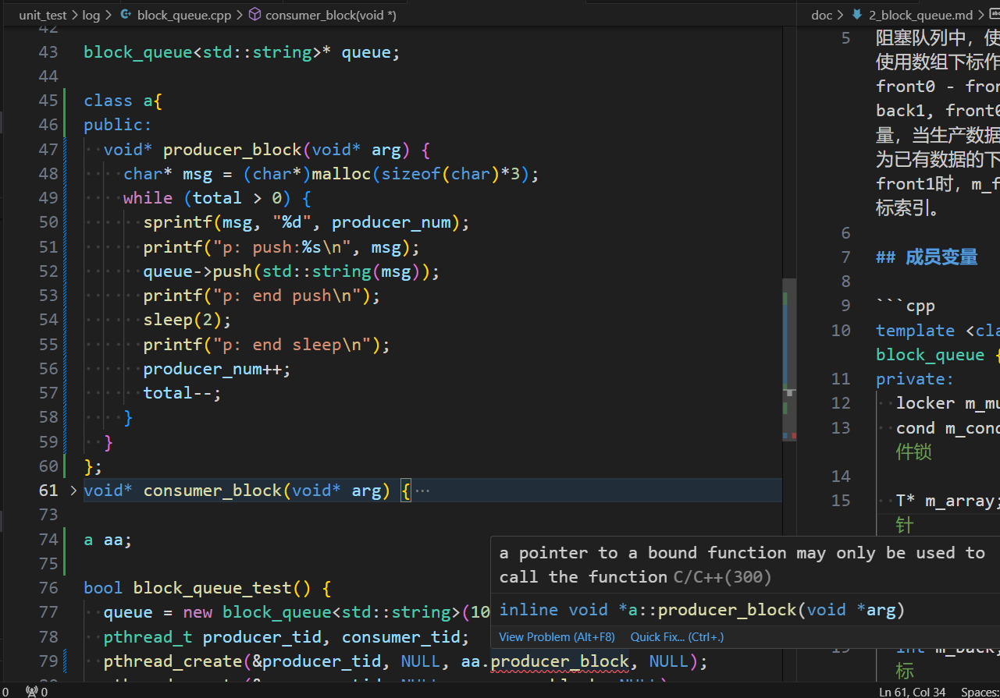

# Log

Log 是本项目支持日志的记录，支持同步写入与异步写入。

## 成员变量

```cpp
class Log {
private:
  int m_close_log;    // 是否关闭日志
  char dir_name[128]; // 保存目录
  char log_name[128]; // 日志文件名
  long long m_count;  // 记录当前行数
  int m_today;        // 天
  FILE* m_fp;         // 文件句柄
  char* m_buf;        // 日志一行buf
  int m_log_buf_size; // 日志一行buf大小
  bool m_is_async;    // 是否异步

  int m_split_lines;  // 达到行数拆分日志文件
  block_queue<string>* m_log_queue; // 异步读写队列
  locker m_mutex;     // 锁
};
```

`m_close_log` 值从外部通过init函数传递过来。在区别m_is_async 后，如果同步，则直接写入文件(同步写); 如果是异步，则写入读写队列，然后通过异步线程主动写入到文件中。

Log 暴露出单例类静态方法以及写日志，同步/异步写入内存函数:

```cpp
class Log {
public:
  // 系统启动首次加载传入参数
  bool init(const char* file_name, int close_log, int log_buf_size = 8192, int split_lines = 5000000, int max_queue_size = 0);
  // 写入日志方法
  void write_log(int level, const char* format, ...);
  // 缓存清空(写入)
  void flush(void);
  // 静态单例方法
  static Log* get_instance();
  // 类静态异步执行方法
  static void* flush_log_thread(void* args);

private:
  Log();
  virtual ~Log();
  void* async_write_log();
```

没有暴露的函数是类的生成与释放，以及类处理日志方法。

## 核心函数(方法)实现

Log::init 识别参数是否开启异步写入方式，接着就是设置文件写入目录及名称:

```cpp
bool Log::init(const char* file_name, int close_log, int log_buf_size, int split_lines, int max_queue_size) {
  // 当识别需要开启异步写入方式时，创建阻塞队列并开启一个线程完成此类任务
  if (max_queue_size > 0) {
    m_log_queue = new block_queue<string>(max_queue_size);
    pthread_t tid;
    pthread_create(&tid, NULL, Log::flush_log_thread, NULL);
    pthread_detach(tid);
    m_is_async = true;
  }
  ...
  // 接着为了生成日志句柄，先把文件名确认出来
  time_t t = time(NULL);
  struct tm* sys_tm = localtime(&t);
  struct tm my_tm = *sys_tm;

  m_today = my_tm.tm_mday;

  const char* p = strrchr(file_name, '/');
  char log_full_name[256] = {NULL};

  if (p == NULL) {
    strcpy(log_name, file_name);
    strcpy(dir_name, "");
    snprintf(log_full_name, sizeof(log_full_name)-1, "%s%d_%02d_%02d_%s", dir_name, my_tm.tm_year+1900, my_tm.tm_mon+1, my_tm.tm_mday, log_name);
  } else {
    // p 包含了 `/`，所以指针前进一格
    strcpy(log_name, p+1);
    strcpy(dir_name, file_name, p-file_name-1);
    snprintf(log_full_name, sizeof(log_full_name)-1, "%s%d_%02d_%02d_%s", dir_name, my_tm.tm_year+1900, my_tm.tm_mon+1, my_tm.tm_mday, log_name);
  }
  // 生成文件句柄
  m_fp = fopen(log_full_name, "a");
  if (!m_fp) return false;

  return true;
}
```

写入日志文件时注意一点: 涉及成员变量修改时及时上锁，及时解锁:

```cpp
void Log::write_log(int level, const char* format, ...) {
  struct timeval now = {NULL, NULL};
  gettimeofday(&now, NULL);
  time_t t = now.tv_sec;
  struct tm* sys_tm = localtime(&t);
  struct tm my_tm = *sys_tm;
  // 展示日志等级
  char s[16] = {NULL};
  ...
  // 下面需要读取或者操作成员变量，所以开始锁住
  m_mutex.lock();
  m_count++;
  // 当(日期不对) || (日志条数达到一级数量)，则新建一个文件保存日志内容
  if (my_tm.tm_mday != m_today || m_count % m_split_lines == 0) {
    fflush(m_fp);
    fclose(m_fp);
    char new_log[256] = {NULL};
    // 先描述年月日文件名段落
    char tail[16] = {NULL};
    snprintf(tail, sizeof(tail)-1, "%d_%02d_%02d_", my_tm.tm_year+1900, my_tm.tm_mon+1, my_tm.tm_mday);
    if (my_tm.tm_mday != m_today) {
      // 隔了一日时，m_count重置为0
      m_count = 0;
      m_today = my_tm.tm_mday;
      snprintf(new_log, sizeof(new_log)-1, "%s%s%s", dir_name, tail, log_name);
    } else {
      // 日志条数达到下一级数量时，格式为 xxx.[1|2|3|...]
      snprintf(new_log, sizeof(new_log)-1, "%s%s%s.%lld", dir_name, tail, log_name, m_count / m_split_lines);
    }
    m_fp = fopen(new_log, "a");
  }
  m_mutex.unlock();

  // 设置一条日志容器
  string log_str;

  va_list va;
  va_start(va, format);
  // 由于下方开始读取或者操作成员变量，则开始加锁
  m_mutex.lock();
  int n = snprintf(m_buf, 48, "%d-%02d-%02d %02d:%02d:%02d.%06d %s ",
                  my_tm.tm_year + 1900, my_tm.tm_mon+1, my_tm.tm_mday,
                    my_tm.tm_hour, my_tm.tm_min, my_tm.tm_sec, now.tv_usec, s);
  int m = vsnprintf(m_buf+n, m_log_buf_size-n-1, format, va);
  m_buf[n+m] = '\n';
  m_buf[n+m+1] = '\n';
  log_str = m_buf; // 日志容器装入日志内容
  m_mutex.unlock();

  va_end(va);
  // 当为异步写入模式，并且阻塞队列没有满，则继续加入阻塞队列
  if (m_is_async && !m_log_queue->full()) {
    m_log_queue->push(log_str);
  } else {
    m_mutex.lock();
    fputs(log_str.c_str(), m_fp);
    m_mutex.unlock();
  }
}
```

最终Log 暴露宏定义方法，如: `LOG_DEBUG`, 注意点是该行上下文能识别到`m_close_log` 变量，即可使用.

## 注意点

Log 使用单例模式，C++0X(C++11)之后保证了静态变量的线程安全性，所以这里使用便捷的声明方式。

> 异步线程执行block 不能使用类的成员函数。类的成员函数会将this指针作为默认参数作为返回参数，与异步线程(void*)冲突，导致无法编译成功，入下图:


