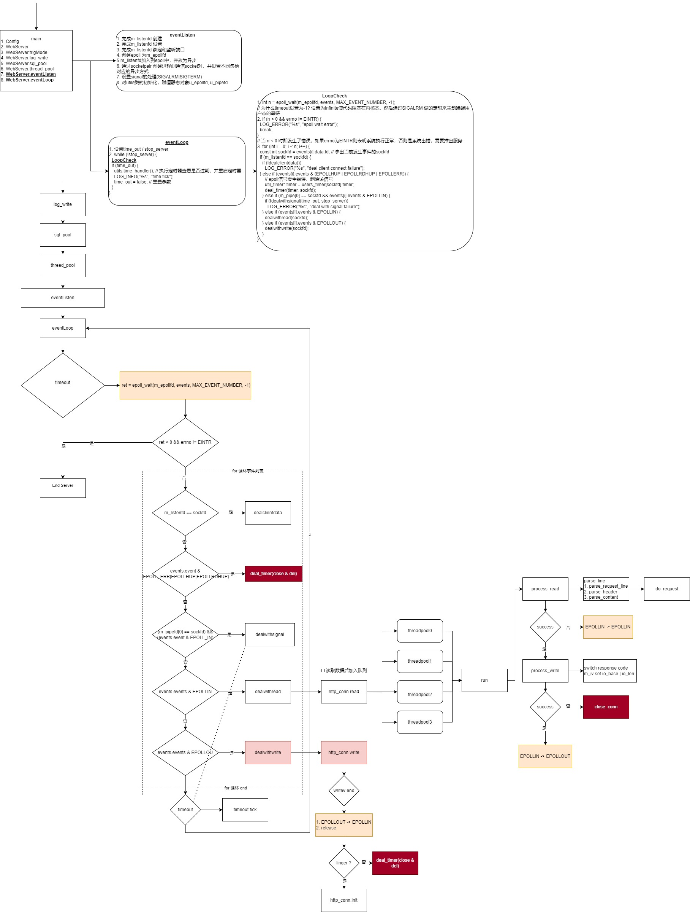

# WebServer

WebServer 监听用户连接采用LT模式，主线程监听用户的连接，并将用户连接加入时间链表。

当前连接(accept)成功的用户将其加入EPOLLIN 复用IO中等待请求的信息。主线程读取用户输入，然后异步线程池执行任务生成结果数据，再将IO状态改为EPOLLOUT后将其返回用户，这种模式成为Proactor模式。



由于需要和业务代码做分离，需要webserver 改为模板类，接受一个输入类，该类实现对应的方法，使用范例参考单元测试。该类在CMake 中链接实现类，使用时include即可。

## 头文件

```cpp
template <class T>
class WebServer {
  WebServer();
  ~WebServer();
  // 类生成后，初始化参数
  void init(int port, string user, string passWord, string databaseName,
            int opt_linger, int sql_threads_num,
            int log_write, int close_log);

  // 初始化打印实例
  void log_write();
  // 初始化数据库连接池
  void sql_pool();
  // 初始化异步任务队列池
  void thread_pool();
  // 事件监听方法
  void eventListen();
  // 事件循环(while 循环)
  void eventLoop();
  // http对象加入到超时管理队列，并且初始化模板输入类的init方法
  void timer(int sockfd, struct sockaddr_in client_address);
  // 将timer过期时间延长
  void adjust_timer(timer_item* timer);
  // EPOLL|SOCKET删除该句柄，并删除该timer
  void deal_timer(timer_item* timer, int sockfd);
  // 用户连接accept处理方法
  bool dealclientdata();
  // 信号(SIGALRM|SIGTERM)处理方法
  bool dealwithsignal(bool& timeout, bool& stop_server);
  // 处理读事件
  void dealwithread(int sockfd);
  // 处理写事件
  void dealwithwrite(int sockfd);

private:
  // 服务监听端口
  int m_port;
  // 前端root绝对路径
  char* m_root;
  // 保存init 参数
  int m_log_write, m_close_log;

  // 网络相关参数
  // 网络监听端口  连接断开设置模式
  int m_listenfd, m_OPT_LINGER;
  // 进程间socket通信组  EPOLL句柄
  int m_pipefd[2], m_epollfd;
  // 默认生成用户数组
  T* users;
  // 默认生成客户连接信息数组
  client_data* users_timer;
  // EPOLL复用事件数组
  epoll_event events[MAX_EVENT_NUMBER];

  // 连接池/任务池相关参数
  // 数据库连接池管理对象
  connection_pool* m_connPool;
  // 异步线程池执行队列管理对象
  threadpool<T>* m_pool;
  // 数据库连接数据(init 方法传入)
  string m_user, m_passWord, m_databaseName;
  int m_sql_threads_num;

  // 帮助方法
  Utils utils;
};
```

## 核心方法

```cpp
// webserver.hpp
template <class T> WebServer<T>::WebServer() {
  // 识别root 文件夹位置并记录至m_root中
  char server_path[256];
  getcwd(server_path, sizeof(server_path)-1);
  char root[] = "/root";
  m_root = (char*)malloc(strlen(server_path) + strlen(root) + 1);
  strcpy(m_root, server_path);
  strcat(m_root, root);
  // 初始化users 和 users_timer 数组
  users = new T[MAX_FD];
  users_timer = new client_data[MAX_FD];
}
// 关闭并且释放内存
template <class T> WebServer<T>::~WebServer() {
  close(m_listenfd);
  close(m_pipefd[0]);
  close(m_pipefd[1]);
  close(m_epollfd);
  delete [] m_root;
  delete [] users;
  delete [] users_timer;
}
```

构造函数中默认生成了固定数量的users 和 users_timer，之后即可直接使用。

接下来直接到事件监听方法，主要任务是生成服务端监听socket，做了相关设置后，加入到epoll中；并且附带生成socket对，也加入到epoll后，方便统一由epoll事件通知并完成相关信息的处置:

```cpp
template <class T> void WebServer<T>::eventListen() {
  // 初始化socket int(*socket)(int domain, int type, int protocol);
  m_listenfd = socket(PF_INET, SOCK_STREAM, 0);
  assert(m_listenfd >= 0);

  if (0 == m_OPT_LINGER) {
    struct linger opt = {0, 1};
    setsockopt(m_listenfd, SOL_SOCKET, SO_LINGER, &opt, sizeof(opt));
  } else {
    struct linger opt = {1, 1};
    setsockopt(m_listenfd, SOL_SOCKET, SO_LINGER, &opt, sizeof(opt));
  }
  // 设置重用监听地址，未设置则socket在bind时失败
  int opt = 1;
  setsockopt(m_listenfd, SOL_SOCKET, SO_REUSEADDR, &opt, sizeof(opt));
  // 设置连接信息，如
  // 协议簇选择AF_INET
  // 端口 htons(nettohostshort) 为什么是short, 因为端口是两个字节，16位，所以能表示的值为 1<<16 = 65536
  // 地址 htonl(nettohl)，并且使用INADDR_ANY(0.0.0.0)
  int ret = -1;
  struct sockaddr_in address;
  address.sin_family = AF_INET;
  address.sin_port = htons(m_port);
  address.sin_addr.s_addr = htonl(INADDR_ANY);
  // 绑定连接信息
  ret = bind(m_listenfd, (struct sockaddr*)&address, sizeof(address));
  assert(ret >= 0);
  // 监听服务器端口
  ret = listen(m_listenfd, 5);
  assert(ret >= 0);

  // 创建epoll对象，参数填>0 即可。
  m_epollfd = epoll_create(1);
  assert(m_epollfd >= 0);
  // 首先先将socket句柄 m_listenfd 加入epoll中，设置为非oneshot并且设置为异步
  utils.addfd(m_epollfd, m_listenfd, false);

  // 生成Socket对，便于通讯。此处采用m_pipefd[1]发送，m_pipefd[0]接收
  // int (*socketpair)(int domain, int type, int protocol, int sv[2]);
  ret = socketpair(AF_UNIX, SOCK_STREAM, 0, m_pipefd);
  assert(ret >= 0);
  // 给接收端加入epoll 的EPOLLIN，并且是非oneshot
  utils.addfd(m_epollfd, m_pipefd[0], false);
  utils.setnonblocking(m_pipefd[1]);

  // 处置信号
  // 如果读通道没打开或者意外终止就往管道写，写进程会收到 SIGPIPE 信号。该信号如果没有设置处理，则会导致进程终止。所以我们这里设置好，不过处置方式为SIG_IGN 也就是ignore 该信号
  /**
   * struct sigaction sa;
   * sa.sa_handler = SIG_IGN;
   * assert(sigaction(SIGPIPE, &sa, 0) != -1);
  */
  utils.addsig(SIGPIPE, SIG_IGN);
  // sa_flags = SA_RESTART: 使被信号大端得系统调用自动重新发起
  // 由于SIGALRM | SIGTERM 信号不需要及时性，不需要严格意义状态，所以置为false
  utils.addisg(SIGALRM, utils.sig_handler, false);
  utils.addsig(SIGTERM, utils.sig_handler, false);
  // 发出一个alarm
  alarm(TIMESLOT);

  // 将epoll句柄和socket对保存为静态数据
  utils.init(TIMESLOT);
  Utils::u_pipefd = m_pipefd;
  Utils::u_epollfd = m_epollfd;
};
```

设置SO_LINGER 是为了将缓冲区数据发送给对方的策略，策略如下:

```
// https://blog.csdn.net/u012635648/article/details/80279338
default 如果有数据残留在socket发送缓冲区中则系统将继续发送这些数据给对方，等待被确认，然后返回。
如果设置了SO_LINGER, 则
  a. 立即关闭该链接，通过发送RST分组(而不是用正常的FIN|ACK|FIN|ACK四个分组)来关闭该链接。至于发送缓冲区中如果有未发送完的数据，则丢弃。主动关闭乙方的TCP状态则跳过TIMEWAIT，直接进入CLOSED
  b. 将丽娜姐的关闭设置一个超时。如果socket发送缓冲区中仍残留数据，进程进入睡眠，内核进入定时状态去尽量发送这些数据。
    - 在超时之前，如果所有数据都发送完且被对方确认，内核用正常的FIN|ACK|FIN|ACK四个分组来关闭该链接，close()成功返回。
    - 如果超时之时，数据仍未能成功发送及被确认，用上述a方式来关闭链接。close()返回EWOULDBLOCK。
/*
 * struct linger {
 *      int 1_onoff;
 *      int 1_linger;
 * };
 * 1_onoff == 0, 则该选项关闭，1_linger的值被忽略，close()用上述缺省方式关闭链接。
 * 1_onoff != 0, 1_linger == 0, close()用上述a方式关闭链接。
 * 1_onoff != 0, 1_linger != 0, close()用上述b方式关闭链接。
 * */
```

以上监听已经启动了，但是要是用户开始连接了，其首先会进入epoll的事件队列，通过`int(*epoll_wait)(int epfd, struct epoll_event* events, int maxevents, int timeout)` 获取到时间总数，通过遍历得到各个事件的目的，作出对应处理:

```cpp
template <class T> void WebServer::eventLoop() {
  bool stop_server = false;
  bool timeout = false;
  // 开启一个事件的循环
  while (!stop_server) {
    // epoll_wait 中使用-1(infinity) 超时，但是由于有alarm 的介入，所以该epoll会间断性唤醒
    int n = epoll_wait(m_epollfd, events, MAX_EVENT_NUMBER, -1);
    // 如果n < 0 并且errno != EINTR 说明该问题不可处理，则结束当前loop
    if (n < 0 && errno != EINTR) {
      break;
    }
    for (int i = 0; i < n; i++) {
      int sockfd = events->data.fd;
      // 首先先判断是否是有用户连接，因为判别数字相等是很快的。任务是去做LT连接，不断从缓存中读取连接即可。
      // (如果是ET，则需一次性全部读取完毕，直至返回-1，并且(errno == EAGIAN) || (errno == EWOULDBLOCK))

      if (m_listenfd == sockfd) {
        if (!dealclientdata())
          LOG_ERROR("deal client data failure!");
      }
      // 如果出错了，则将该事件对应的socket 关闭并去除
      else if (events->events & (EPOLLERR | EPOLLHUP | EPOLLRDHUP)) {
        timer_item* timer = users_timer[i].timer;
        deal_timer(timer, sockfd);
      }
      // 判别是否是信号
      else if (sockfd == m_pipefd[0] && events->events & EPOLLIN) {
        if (!dealwithsignal(timeout, stop_server))
          LOG_ERROR("deal signal failure!");
      }
      // 判别读入事件
      else if (events->events & EPOLLIN) {
        dealwithread(sockfd);
      }
      // 判别发送事件
      else if (events->events & EPOLLOUT) {
        dealwithwrite(sockfd);
      }
    }
    // 当以上读取到超时信号，则去超时链表中执行超时检测。结束后重置timeout = false
    if (timeout) {
      utils.time_handler();
      LOG_INFO("time tick");
      timeout = false;
    }
  }
}
```

事件循环其实就是while 循环动作，通过对该次事件循环任务处置，然后再次等待IO事件的唤醒。接下来实现如接收用户连接/接收信号/接收读入、发送都是LT模式，只需要做出对应动作。如果IO事件缓存还有数据，则下一个事件循环会继续接收。(如果是ET模式，则需要在此次通知中将IO事件缓存所有数据都拿出，直到返回值为-1，并且(errno == EAGIAN) || (errno == EWOULDBLOCK) 才停止。)

```cpp
template <class T> void WebServer<T>::timer(int sockfd, struct sockaddr_in client_address) {
  // 模板传入类执行init方法
  users[sockfd].init(sockfd, client_address, m_root, m_user, m_passWord, m_databaseName, m_close_log);
  // 补充timer相关属性，并且通过utils.m_timer_lst.add_timer 添加该timer
  timer_item* timer = new timer_item;
  timer->cb_func = cb_func;
  time_t t = time(NULL);
  timer->expire = t + 3 * TIMESLOT;
  timer->user_data = &users_timer[sockfd];

  users_timer[sockfd].sockfd = sockfd;
  users_timer[sockfd].address = client_address;
  users_timer[sockfd].timer = timer;

  utils.m_timer_lst.add_timer(timer);
}
// 延长timer过期时间戳
template <class T> void WebServer<T>::adjust_timer(timer_item* timer) {
  ...
}
// 处置timer，执行 cb_func 后，通过utils.m_timer_lst.del_timer 删除timer
template <class T> void WebServer<T>::deal_timer(timer_item* timer, int sockfd) {
  if (timer) {
    timer->cb_func(timer->user_data);
    utils.m_timer_lst.del_timer(timer);
  }
}
// 处理信号
template <class T> bool WebServer<T>::dealwithsignal(bool& timeout, bool& stop_server) {
  ...
}
template <class T> void WebServer<T>::dealwithread(int sockfd) {
  timer_item* timer = users_timer[sockfd].timer;
  // 通过主线程read 获取socket 读取缓存数据后，将其加入到任务队列
  if (users[sockfd].read()) {
    adjust_timer(timer);
    m_pool->append(users + sockfd);
  } else {
    deal_timer(timer, sockfd);
  }
}
template <class T> void WebServer<T>::dealwithwrite(int sockfd) {
  timer_item* timer = users_timer[sockfd].timer;
  // write 如果成功，1. 有EINTR出现，内部重新加载EPOLLOUT； 2. 说明其内部修改为EPOLLIN
  // 所以write完后，更新超时时间即可(不必将其再次加入threadpool)
  if (users[sockfd].write()) {
    adjust_timer(timer);
  } else {
    deal_timer(timer, sockfd);
  }
}
template <class T> bool WebServer<T>::dealclientdata() {
  struct sockaddr_in address;
  socklen_t len = sizeof(address);
  // LT模式直接接收客户端连接
  int sockfd = accept(m_listenfd, (struct sockaddr*)&address, &len);
  if (sockfd < 0) {
    if (errno == EWOULDBLOCK || errno == EAGAIN) {
      return true;
    }
    return false;
  }
  // 连接后初始化业务对象将其加入超时队列
  timer(sockfd, address);
  return true;
}
```

以上通过实现对socket的相关操作，流程化事件循环完成Proactor+LT模式的监听。

## 测试

请参考单元测试用例。
